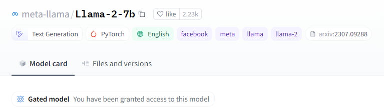
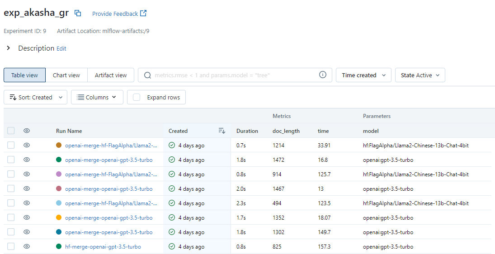
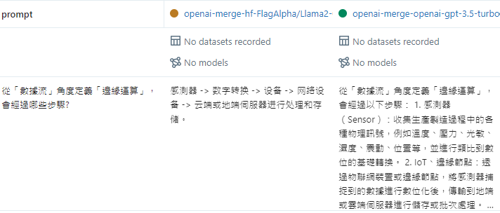

# Installation

We recommend using Python 3.8 to run our Akasha package. You can use Anaconda to create virtual environment.

```bash

# create environment

conda create --name py3-8 python=3.8
activate py3-8

# install akasha
pip install git+https://gitlab-devops.iii.org.tw/root/qaiii-1.git


```


<br/>
<br/>

## API Keys

### OPENAI 
If you want to use openai models or embeddings, go to [openai](https://platform.openai.com/account/api-keys) to get the API key. 
You can either save **OPENAI_API_KEY=your api key** into **.env** file to current working directory or,
set as a environment variable, using **export** in bash or use **os.environ** in python.

```bash

# set a environment variable

export OPENAI_API_KEY="your api key"


```

```python
#PYTHON3.8
response = akasha.get_response(dir_path, prompt, model="openai:gpt-3.5-turbo")


```


<br/>
<br/>


### LLAMA-2 
If you want to use original meta-llama model, you need to both register to [huggingface](https://huggingface.co/settings/tokens) to get access token and [meta-llama](https://ai.meta.com/resources/models-and-libraries/llama-downloads/) to request access. 

**Remember, the account on Hugging Face and the email you use to request access to Meta-Llama must be the same, so that you can download models from Hugging Face once your account is approved.**

You should see the **Gated model You have been granted access to this model** once your account is approved



<br/>
<br/>

Again, you can either save **HUGGINGFACEHUB_API_TOKEN=your api key** into **.env** file to current working directory or set as a environment variable, using **export** in bash or use **os.environ** in python.

```bash

# set a environment variable

export HUGGINGFACEHUB_API_TOKEN="your api key"


```

```python
#PYTHON3.8
response = akasha.get_response(dir_path, prompt, model="hf:meta-llama/Llama-2-7b-chat-hf")


```


<br/>
<br/>


# Example and Parameters

## Basic get_response OpenAI example


``` python
import akasha
import os


os.environ["OPENAI_API_KEY"] = "your openAI key"

dir_path = "doc/"
prompt = "「塞西莉亞花」的花語是什麼?	「失之交臂的感情」	「赤誠的心」	「浪子的真情」	「無法挽回的愛」"

response = akasha.get_response(dir_path, prompt)
print(response)
	
	
```


``` python
「塞西莉亞花」的花語為「浪子的真情」
```

<br/>
<br/>
<br/>
<br/>


## Select different embeddings

Using parameter "embeddings", you can choose different embedding models, and the embedding model will be used to store documents into vector storage and search relevant documents from prompt.  Default is **openai:text-embedding-ada-002**.

Currently support **openai**, **huggingface** and **tensorflowhub**.

### huggingface example

``` 
akasha.get_response(dir_path, prompt, embeddings="huggingface:all-MiniLM-L6-v2")
```
To use huggingface embedding models, you can type huggingface:model_name or hf:model_name, for example, **huggingface:all-MiniLM-L6-v2**

<br/>
<br/>
<br/>
<br/>


## Select different models
Using parameter **"model"**, you can choose different text generation models, default is **openai:gpt-3.5-turbo**.

Currently support **openai**, **llama-cpp** and **huggingface**.

### 1.huggingface example
``` python
akasha.get_response(dir_path, prompt, embeddings="huggingface:all-MiniLM-L6-v2", model="hf:meta-llama/Llama-2-13b-chat-hf")

```

To use text generation model from **huggingface**, for example, meta llama, you can type **hf:meta-llama/Llama-2-13b-chat-hf**


<br/>
<br/>

### 2.llama-cpp example
llama-cpp can use quantized llama model and run on cpu, after you download or transfer llama-cpp model file using [llama-cpp-python](https://github.com/abetlen/llama-cpp-python).

```python
akasha.get_response(dir_path, prompt, embeddings="huggingface:all-MiniLM-L6-v2", model="llama-cpu:model/llama-2-13b-chat.ggmlv3.q4_0.bin")

```

For example, if q4 model is in the "model/" directory, you can assign **llama-cpu:model/llama-2-13b-chat.ggmlv3.q4_0.bin** to load model.

```python
akasha.get_response(dir_path, prompt, embeddings="huggingface:all-MiniLM-L6-v2", model="llama-gpu:model/llama-2-13b-chat.ggmlv3.q4_0.bin")

```
you can also combine gpu with cpu to run llama-cpp, using **llama-gpu:model/llama-2-13b-chat.ggmlv3.q4_0.bin**

<br/>
<br/>
<br/>
<br/>


## Select different search type
Using parameter **"search_type"**, you can choose different search methods to find similar documents , default is **merge**, which is
the combination of mmr, svm and tfidf. Currently you can select merge, mmr, svm and tfidf.

**Max Marginal Relevance(mmr)** select similar documents by cosine similarity, but it also consider diversity, so it will also penalize document for closeness to already selected documents.

**Support Vector Machines(svm)** use the input prompt and the documents vectors to train svm model, after training, the svm can be used to score new vectors based on their similarity to the training data. 

**Term Frequency–Inverse Document Frequency(tfidf)** is a commonly used weighting technique in information retrieval and text mining. TF-IDF is a statistical method used to evaluate the importance of a term in a collection of documents or a corpus with respect to one specific document in the collection.


``` python
akasha.get_response(dir_path, prompt, search_type="mmr")

```
 
<br/>
<br/>
<br/>
<br/>


## Some models you can use

```python
openai_model = "openai:gpt-3.5-turbo"  # need environment variable "OPENAI_API_KEY"
huggingface_model = "hf:meta-llama/Llama-2-7b-chat-hf" #need environment variable "HUGGINGFACEHUB_API_TOKEN" to download meta-llama model
quantized_ch_llama_model = "hf:FlagAlpha/Llama2-Chinese-13b-Chat-4bit"

### If you want to use llama-cpp to run model on cpu, you can download ggml version of models 
### from  https://huggingface.co/TheBloke/Llama-2-13B-chat-GGML/tree/main  and the name behind "llama-gpu:" or "llama-cpu:"
### is the path of the downloaded .bin file
llama_cpp_model = "llama-gpu:model/llama-2-13b-chat.ggmlv3.q4_0.bin"  
llama_cpp_model = "llama-cpu:model/llama-2-7b-chat.ggmlv3.q8_0.bin"
chatglm_model = "chatglm:THUDM/chatglm2-6b"


```


<br/>


## Some embeddings you can use

```python
openai_emd = "openai:text-embedding-ada-002"  # need environment variable "OPENAI_API_KEY"
huggingface_emd = "hf:all-MiniLM-L6-v2" 
text2vec_ch_emd = "hf:shibing624/text2vec-base-chinese"


```

<br/>
<br/>
<br/>
<br/>


# Functions

## Use chain-of-thought to solve complicated problem
 
instead of input one single prompt, you can input multiple small stop questions to get better answer.  
 
 
```python
import akasha
import os


os.environ["OPENAI_API_KEY"] = "your openAI key"

dir_path = "mic/"
queries2 = ["西門子自有工廠如何朝工業4.0 發展","詳細解釋「工業4.0 成熟度指數」發展路徑的六個成熟度","根據西門子自有工廠朝工業4.0發展，探討其各項工業4.0的成熟度指標"]

response = akasha.chain_of_thought(dir_path, queries2, search_type='svm')
print(response)
	
	
```


```text
response 1:
西門子自有工廠朝工業4.0發展的方式包括以下幾個方面：

1. 數位化戰略：西門子提出數位化戰略，從工業4.0策略擬定到落地執行，為客戶提供一條龍服務。他們設計數位工廠原型
，搭配OT、IT方案，並使用西門子的MindSphere工業物聯網平台，發展數據可視化和數據分析相關應用。

2. 跨領域合作：西門子近年積極與雲服務商、系統商等跨領域合作，推動智慧製造解決方案。此外，他們也與SAP進行ERP整合，專注於物聯網領域。

3. 虛實整合：西門子在中國大陸成都生產研發基地的案例中，從研發、生產、訂單管理、供應商管理到物流作業
，實現了整條價值鏈的虛實整合。他們不斷提高配料、傳輸、檢測等流程的自動化程度。

總體而言，西門子通過數位化戰略、跨領域合作和虛實整合等方式，推動自有工廠朝工業4.0發 
展。他們致力於提升生產效率和效能，並利用先進的技術和解決方案實現智慧工廠的建設。


response 2:
「工業4.0成熟度指數」的發展路徑劃分為六個成熟度，分別是電腦化、可連結、可視化、可分析、可預測和自適應。

1. 電腦化：這是工業4.0發展的起點，指企業開始使用計算機技
術，人員不再手動操作機械。然而，機械仍未聯網，各個IT系統仍各自獨立，資料尚未串聯。例如，企業的ERP系統與生產相關的系統獨立運作，訂單與產品品檢紀錄分散於兩套系統，導致 
訂單無法回溯出現品質問題的環節。

2. 可連結：在這個成熟度階段，企業開始將各個IT系統進行連接，實現資料的串聯。這使得不同系統之間可以共享資料，提高資訊的流通效率。例 
如，企業的ERP系統與生產相關的系統進行連接，訂單與產品品檢紀錄可以實現資料的回溯。

3. 可視化：在這個成熟度階段，企業開始實現資料的可視化，將資料以圖形化或圖表化的方
式呈現，使得管理者可以直觀地了解企業的運營狀況。例如，企業可以使用數據儀表板或報表來呈現生產線的運行情況和產品的品質指標。

4. 可分析：在這個成熟度階段，企業開始進 
行資料的分析，利用數據分析工具和算法來挖掘資料中的價值和洞察。這使得企業可以更深入地了解生產過程中的問題和潛在的改進空間。例如，企業可以使用數據分析工具來分析生產線的
效率和品質問題，並提出改進措施。

5. 可預測：在這個成熟度階段，企業開始利用資料分析的結果來進行預測和預測模型的建立。這使得企業可以預測生產過程中可能出現的問題，並 
提前採取相應的措施。例如，企業可以利用預測模型來預測生產線的故障和產品的品質問題，並提前進行維護和調整。

6. 自適應：在這個成熟度階段，企業開始實現自動化和自適應能 
力，使得生產過程可以根據實時的數據和環境變化進行調整和優化。這使得企業可以更靈活地應對市場需求和生產變化。例如，企業可以實現生產線的自動調整和產品的自動優化，以適應市
場需求的變化。

這六個成熟度階段代表了企業在工業4.0發展過程中的不同階段和能力水平，企業可以根據自身的情況和目標，逐步提升成熟度，實現工業4.0的目標。


response 3:
根據西門子自有工廠朝工業4.0發展的方式，可以探討其在工業4.0成熟度指標中的幾個方面：

 

1. 數位化戰略：西門子提出數位化戰略，從工業4.0策略擬定到落地執行提供一條龍服務
。這代表企業在工業4.0成熟度指標中已經達到了可連結和可視化的階段，並開始將數據應用於生產優化和資源利用。

 

2. 整合系統：西門子在廠內進行軟體間整合，包括PLM、ERP、MOM 
、WMS和Automation五大系統的整合，使數據互聯互通。這代表企業在工業4.0成熟度指標中已經達到了可分析和可預測的階段，並能夠利用數據分析技術進行深入分析和預測。

 

3. 數據 應用：西門子利用自有的數位雙生軟體Tecnomatix，打造虛擬工廠，模擬生產狀況或監控實際生產狀況。這代表企業在工業4.0成熟度指標中已經達到了可分析和可預測的階段，並能夠利用 
數據應用提供的資訊，優化生產設備和工序。

 

總的來說，根據西門子自有工廠朝工業4.0發展的方式，可以看出他們在工業4.0成熟度指標中已經達到了可連結、可視化、可分析和可預測，優化生產設備和工序。
```

<br/>
<br/>

<br/>
<br/>

## Use AiiDO to record experiment 


If you want to record experiment metrics and results, you need to create a project on the AiiDO platform. Once done, 
you will receive all the necessary parameters for automatically uploading the experiment. 

Create a .env file on the same directory of your program, and paste all parameters.


.env file

```python
MINIO_URL= YOUR_MINIO_URL
MINIO_USER= YOUR_MINIO_USER
MINIO_PASSWORD= YOUR_MINIO_PASSWORD
TRACKING_SERVER_URI= YOUR_TRACKING_SERVER_URI
```
<br/>
<br/>

After you created .env file, you can use **record_exp** to set your experiment name and it will automatically record 
experiment metrics and results to mlflow server.

```python
import akasha
import os
from dotenv import load_dotenv
load_dotenv() 

os.environ["OPENAI_API_KEY"] = "your openAI key"

dir_path = "doc/"
prompt = "「塞西莉亞花」的花語是什麼?	「失之交臂的感情」	「赤誠的心」	「浪子的真情」	「無法挽回的愛」"
exp_name = "exp_akasha_get_response"
response = akasha.get_response(dir_path, prompt,record_exp=exp_name)

```

<br/>
<br/>


<br/>
<br/>


### In an experiment you assign, the run name is the combinations of the usage of embedding, search type and model name




<br/>
<br/>
<br/>
<br/>

### You can also compare the responses from different models, search type and embeddings





<br/>
<br/>
<br/>
<br/>


## Test Performance

To evaluate the performance of current parameters, you can use function **test_performance** . First you need to build a question set .txt
file based on the documents you want to use, each question in the question set must be a single choice question, every options and the correct
answer is separated by space, each line is a question, **for example:**  (question_pvc.txt)

```text

應回收廢塑膠容器材質種類不包含哪種?  聚丙烯（PP） 聚苯乙烯（PS） 聚氯乙烯（PVC）  低密度聚乙烯（LDPE）  4
庫存盤點包括庫存全盤作業及不定期抽盤作業，盤點計畫應包括下列項目不包含哪項?   盤點差異之處理   盤點清冊  各項物品存放區域配置圖  庫存全盤日期及參加盤點人員名單  1
以下和者不是環保署指定之公民營地磅機構?    中森加油站企業有限公司   台益地磅站  大眾地磅站  新福行  4

```

**test_performance** will return the correct rate of the question set, details of each question would save in logs, or in mlflow server if you
turn on **record_exp** 

```python
import akasha
import os
from dotenv import load_dotenv
load_dotenv() 

os.environ["OPENAI_API_KEY"] = "your openAI key"
dir_path = "doc/pvc/"
exp_name = "exp_akasha_test_performance"

print(akasha.test_performance("question_pvc.txt", dir_path, search_type='merge',\
     model="openai:gpt-3.5-turbo", embeddings="openai:text-embedding-ada-002",record_exp=exp_name))
## 1.0 ##
```


<br/>
<br/>
<br/>
<br/>


## Find Optimum Combination

To test all available combinations and find the best parameters, you can use function **optimum_combination** , you can give different 
embeddings, document chunk sizes, models, document similarity searching type and number of most relative documents (topK), and the function will
test all combinations to find the best combination based on the given question set and documents. 

Noted that best score combination is the highest correct rate combination, and best cost-effective 
combination is the combination that need least tokens to get a correct answer.


```python
import akasha
import os
from dotenv import load_dotenv
load_dotenv() 

os.environ["OPENAI_API_KEY"] = "your openAI key"
os.environ["HUGGINGFACEHUB_API_TOKEN"] = "your huggingface key"
dir_path = "doc/pvc/"
exp_name = "exp_akasha_optimum_combination"
embeddings_list = ["hf:shibing624/text2vec-base-chinese", "openai:text-embedding-ada-002"]
model_list = ["openai:gpt-3.5-turbo","hf:FlagAlpha/Llama2-Chinese-13b-Chat-4bit","hf:meta-llama/Llama-2-7b-chat-hf",\
            "llama-gpu:model/llama-2-7b-chat.ggmlv3.q8_0.bin", "llama-gpu:model/llama-2-13b-chat.ggmlv3.q8_0.bin"]
akasha.optimum_combination("question_pvc.txt", dir_path, embeddings_list = embeddings_list,model_list = model_list,
            chunk_size_list=[200, 400, 600], search_type_list=["merge","tfidf",],record_exp=exp_name,topK_list=[2,3])

```

**The result would look like below**

```text

Best correct rate:  1.000
Best score combination:  

embeddings: openai:text-embedding-ada-002, chunk size: 400, model: openai:gpt-3.5-turbo, topK: 3, search type: merge

 

embeddings: openai:text-embedding-ada-002, chunk size: 400, model: openai:gpt-3.5-turbo, topK: 3, search type: tfidf

 

 

Best cost-effective:

embeddings: hf:shibing624/text2vec-base-chinese, chunk size: 400, model: openai:gpt-3.5-turbo, topK: 2, search type: tfidf

```


<br/>
<br/>
<br/>
<br/>


## Use llm to create questionset and evaluate the performance
If you prefer not to create your own question set to assess the performance of the current parameters, you can utilize the **eval.auto_create_questionset** feature to automatically generate a question set along with reference answers. Subsequently, you can use **eval.auto_evaluation** to obtain scores for metrics such as **Bert_score**, **Rouge**, and **LLM_score**. These scores range from 0 to 1, with higher values indicating that the generated response closely matches the reference answers.

For example, the code create a questionset text file 'mic_1.txt' with ten questions and reference answers, each question is randomly generated from the content segments of given documents in 'doc/mic/' directory. Then you can use the questionset text file to evaluate the performance of the parameters you want to test.


```python

import akasha.eval as eval
eval.auto_create_questionset(doc_path="doc/mic/", question_num=10, record_exp="exp_mic_auto_questionset")
bert_score, rouge, llm_score = eval.auto_evaluation(questionset_path="questionset/mic_1.txt", doc_path="doc/mic/", record_exp="exp_mic_auto_evaluation",topK=3,search_type="svm")

# bert_score = 0.782
# rouge = 0.81
# llm_score = 0.393
```


<br/>
<br/>
<br/>
<br/>


## File Summarization
To create a summary of a text file in various formats like .pdf, .txt, or .docx, you can use the **summary.summarize_file** function. For example, the following code employs the **map_reduce** summary method to instruct LLM to generate a summary of approximately 500 words.

There're two summary type, **map_reduce** and **refine**, **map_reduce** will summarize every text chunks and then use all summarized text chunks to generate a final summary; **refine** will summarize each text chunk at a time and using the previous summary as a prompt for 
summarizing the next segment to get a higher level of summary consistency.

```python

import akasha.summary as summary
summary.summarize_file("doc/mic/5軸工具機因應市場訴求改變的發展態勢.pdf", chunk_size=1000, chunk_overlap=40,\
summary_type="map_reduce", summary_len=500)


```


<br/>
<br/>
<br/>
<br/>

# Command Line Interface
You can also use akasha in command line, for example, you can use **keep-responsing** to create a document QA model 
and keep asking different questions and get response based on the documents in the given -d directory.


```console
$ akasha keep-responsing -d ../doc/plc/  -c 400 -k 1
Please input your question(type "exit()" to quit) : 應回收廢塑膠容器材質種類不包含哪種?  聚丙烯（PP） 聚苯乙烯（PS） 聚氯乙烯（PVC）  低密度聚乙烯（LDPE）
Response:  應回收廢塑膠容器材質種類不包含低密度聚乙烯（LDPE）。


Please input your question(type "exit()" to quit) : 所謂市盈率，是指每股市價除以每股盈餘，也就是股票的?   本益比  帳面值比  派息   資金
英國和德國等多個市場。然而，義大利、加拿大和澳洲並不在這些可交易的國家之列。


Please input your question(type "exit()" to quit) : exit()

```

<br/>
<br/>

Currently you can use **get-response**, **keep-responsing**, **chain-of-thought** and **test-performance**.
  


```bash
$ akasha keep-responsing --help
Usage: akasha keep-responsing [OPTIONS]

Options:
  -d, --doc_path TEXT         document directory path, parse all .txt, .pdf,
                              .docx files in the directory  [required]
  -e, --embeddings TEXT       embeddings for storing the documents
  -c, --chunk_size INTEGER    chunk size for storing the documents
  -m, --model TEXT            llm model for generating the response
  -k, --topk INTEGER          select topK relevant documents
  -t, --threshold FLOAT       threshold score for selecting the relevant
                              documents
  -l, --language TEXT         language for the documents, default is 'ch' for
                              chinese
  -s, --search_type TEXT      search type for the documents, include merge,
                              svm, mmr, tfidf
  -sys, --system_prompt TEXT  system prompt for the llm model
  --help                      Show this message and exit.

```
