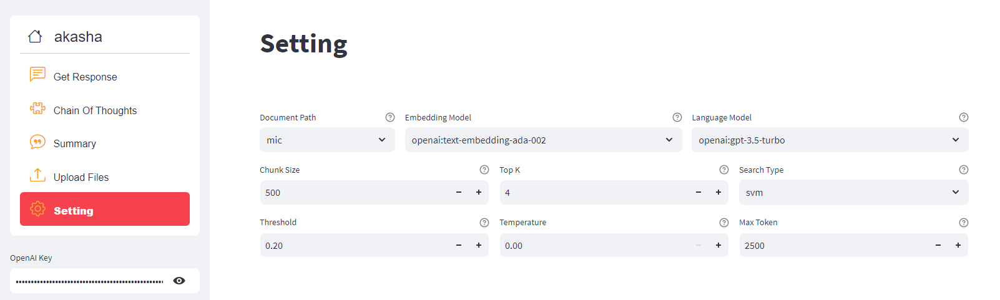
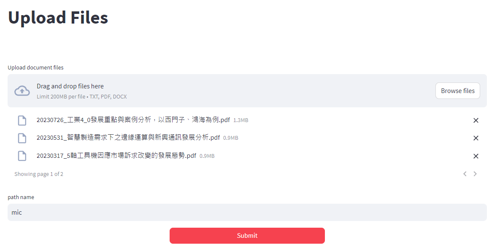
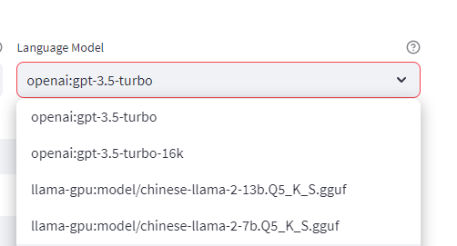
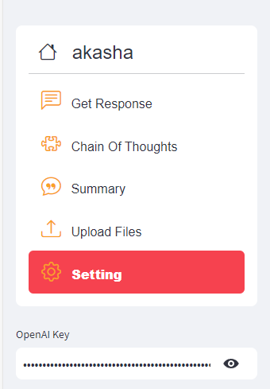
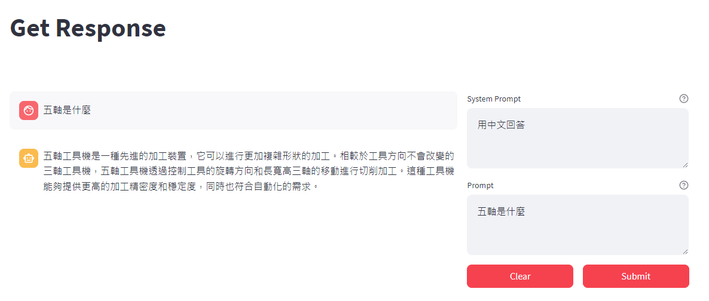

# akasha

[](https://opensource.org/licenses/MIT)
[](https://pypi.org/project/akasha-terminal/)
[](https://pypi.org/project/akasha-terminal/)
[](https://www.python.org/downloads/release/python-380/)


<br/>

akasha simplifies document-based Question Answering (QA) and Retrieval Augmented Generation(RAG) by harnessing the power of Large Language Models to accurately answer your queries while searching through your provided documents.

With akasha, you have the flexibility to choose from a variety of language models, embedding models, and search types. Adjusting these parameters is straightforward, allowing you to optimize your approach and discover the most effective methods for obtaining accurate answers from Large Language Models.

For the chinese manual, please visit [manual](https://hackmd.io/@akasha-terminal-2024/ryS4pS1ca)

<br/>
<br/>

<br/>
<br/>


# Updates
- 0.8.55
    add extract_db_by_file and extract_db_by_keyword functions.


- 0.8.53

    1. akasha Doc_QA add stream parameter, if stream=True, return will be generator.
    2. get_response and ask_self add history_messages parameter, use to pass chat history to model
    3. prompt_format_type add chat_gpt and chat_mistral, which change prompt, system_prompt and history_messages into instruct format: [{"role":current_role, "content":prompt}]
    4. add helper function call_model, call_batch_model, call_stream_model
    5.  allow pass model object (LLM) and embedding object (Embeddings) to Doc_QA, Eval, and Summary, prevent redefine of the objects.
    6. add helper function self_rag
    7. Doc_QA ask_self and ask_whole_file can allow document(info) larger then max_doc_len by calling models multiple times.
    8. Doc_QA get_response can pass dbs object to doc_path, prevent reload the chromadb data.
    9. add fastapi in akasha, you can activate  fastapi using "akasha api (--port port --host host --workers num_of_workers)"


<br/>
<br/>

<br/>
<br/>


# Installation

We recommend using Python 3.9 to run our akasha package. You can use Anaconda to create virtual environment.

```bash

# create environment

conda create --name py3-9 python=3.9
activate py3-9

# install akasha
pip install akasha-terminal


```


<br/>
<br/>

## API Keys

### OPENAI 
If you want to use openai models or embeddings, go to [openai](https://platform.openai.com/account/api-keys) to get the API key. 
You can either save **OPENAI_API_KEY=your api key** into **.env** file to current working directory or,
set as a environment variable, using **export** in bash or use **os.environ** in python.

```bash

# set a environment variable

export OPENAI_API_KEY="your api key"


```

<br/>
<br/>

### AZURE OPENAI
If you want to use azure openai, go to [auzreAI](https://oai.azure.com/portal) and get you own Language API base url and key.
Also, remember to depoly all the models in [Azure OpenAI Studio](https://oai.azure.com/portal), the deployment name should be same as the model name. save **OPENAI_API_KEY=your azure key**,  **OPENAI_API_BASE=your Language API base url**, **OPENAI_API_TYPE=azure**, **OPENAI_API_VERSION=2023-05-15** into **.env** file to current working directory.

<br/> 

If you want to save both openai key and azure key at the same time, you can also use **AZURE_API_KEY**, **AZURE_API_BASE**, **AZURE_API_TYPE**, **AZURE_API_VERSION**


```sh
## .env file
AZURE_API_KEY={your azure key}
AZURE_API_BASE={your Language API base url}
AZURE_API_TYPE=azure
AZURE_API_VERSION=2023-05-15

```


<br/>
<br/>

And now we can run akasha in python 

```python
#PYTHON3.9
import akasha
ak = akasha.Doc_QA(model="openai:gpt-3.5-turbo")
response = ak.get_response(dir_path, prompt)


```


<br/>
<br/>


# Example 


``` python
import akasha
import os


os.environ["OPENAI_API_KEY"] = "your openAI key"

dir_path = "doc/"
prompt = "「塞西莉亞花」的花語是什麼?	「失之交臂的感情」	「赤誠的心」	「浪子的真情」	「無法挽回的愛」"
ak = akasha.Doc_QA(search_type="auto")
response = ak.get_response(dir_path, prompt)
print(response)
	
	
```


``` python
「塞西莉亞花」的花語為「浪子的真情」
```

<br/>
<br/>
<br/>
<br/>


## Some models you can use

Please note that for OpenAI models, you need to set the environment variable 'OPENAI_API_KEY,' and for most Hugging Face models, a GPU is required to run the models. However, for .gguf models, you can use a CPU to run them.

```python
openai_model = "openai:gpt-3.5-turbo"  # need environment variable "OPENAI_API_KEY" or "AZURE_API_KEY"
openai4_model = "openai:gpt-4"  # need environment variable "OPENAI_API_KEY" or "AZURE_API_KEY"
openai4o_model = "openai:gpt-4o" # need environment variable "OPENAI_API_KEY"
huggingface_model = "hf:meta-llama/Llama-2-7b-chat-hf" #need environment variable "HUGGINGFACEHUB_API_TOKEN" to download meta-llama model
quantized_ch_llama_model = "gptq:FlagAlpha/Llama2-Chinese-13b-Chat-4bit"
taiwan_llama_gptq = "gptq:weiren119/Taiwan-LLaMa-v1.0-4bits-GPTQ"
mistral = "hf:Mistral-7B-Instruct-v0.2" 
mediatek_Breeze = "hf:MediaTek-Research/Breeze-7B-Instruct-64k-v0.1"
### If you want to use llama-cpp to run model on cpu, you can download gguf version of models 
### from https://huggingface.co/TheBloke/Llama-2-7b-Chat-GGUF  and the name behind "llama-gpu:" or "llama-cpu:"
### from https://huggingface.co/TheBloke/CodeUp-Llama-2-13B-Chat-HF-GGUF
### is the path of the downloaded .gguf file
llama_cpp_model = "llama-gpu:model/llama-2-13b-chat-hf.Q5_K_S.gguf"  
llama_cpp_model = "llama-cpu:model/llama-2-7b-chat.Q5_K_S.gguf"
llama_cpp_chinese_alpaca = "llama-gpu:model/chinese-alpaca-2-7b.Q5_K_S.gguf"
llama_cpp_chinese_alpaca = "llama-cpu:model/chinese-alpaca-2-13b.Q5_K_M.gguf"
chatglm_model = "chatglm:THUDM/chatglm2-6b"

```


<br/>


## Some embeddings you can use

Please noted that each embedding model has different window size, texts that over the max seq length will be truncated and won't be represent
in embedding model.

Rerank_base and rerank_large are not embedding models; instead, they compare the query to each chunk of the documents and return scores that represent the similarity. As a result, they offer higher accuracy compared to embedding models but may be slower.

```python
openai_emd = "openai:text-embedding-ada-002"  # need environment variable "OPENAI_API_KEY"  # 8192 max seq length
huggingface_emd = "hf:all-MiniLM-L6-v2" 
text2vec_ch_emd = "hf:shibing624/text2vec-base-chinese"   # 128 max seq length 
text2vec_mul_emd = "hf:shibing624/text2vec-base-multilingual"  # 256 max seq length
text2vec_ch_para_emd = "hf:shibing624/text2vec-base-chinese-paraphrase" # perform better for long text, 256 max seq length
bge_en_emd = "hf:BAAI/bge-base-en-v1.5"  # 512 max seq length
bge_ch_emd = "hf:BAAI/bge-base-zh-v1.5"  # 512 max seq length

rerank_base = "rerank:BAAI/bge-reranker-base"    # 512 max seq length
rerank_large = "rerank:BAAI/bge-reranker-large"  # 512 max seq length

```

<br/>
<br/>
<br/>
<br/>


## File Summarization
To create a summary of a text file in various formats like .pdf, .txt, or .docx, you can use the **Summary.summarize_file** function. For example, the following code employs the **map_reduce** summary method to instruct LLM to generate a summary of approximately 500 words.

There're two summary type, **map_reduce** and **refine**, **map_reduce** will summarize every text chunks and then use all summarized text chunks to generate a final summary; **refine** will summarize each text chunk at a time and using the previous summary as a prompt for 
summarizing the next segment to get a higher level of summary consistency.

```python

import akasha
sum = akasha.Summary( chunk_size=1000, chunk_overlap=100)
sum.summarize_file(file_path="doc/mic/5軸工具機因應市場訴求改變的發展態勢.pdf",summary_type="map_reduce", summary_len=500\
, chunk_overlap=40)


```
<br/>
<br/>

```python
"""
### Arguments of Summary class ###
 Args:
            **chunk_size (int, optional)**: chunk size of texts from documents. Defaults to 1000.
            **chunk_overlap (int, optional)**: chunk overlap of texts from documents. Defaults to 40.
            **model (str, optional)**: llm model to use. Defaults to "gpt-3.5-turbo".
            **verbose (bool, optional)**: show log texts or not. Defaults to False.
            **threshold (float, optional)**: the similarity threshold of searching. Defaults to 0.2.
            **language (str, optional)**: the language of documents and prompt, use to make sure docs won't exceed
                max token size of llm input.
            **record_exp (str, optional)**: use aiido to save running params and metrics to the remote mlflow or not if record_exp not empty, and setrecord_exp as experiment name.  default "".
            **system_prompt (str, optional)**: the system prompt that you assign special instruction to llm model, so will not be used
                in searching relevant documents. Defaults to "".
            **max_doc_len(int, optional)**: max docuemnt length of llm input. Defaults to 3000.
            **temperature (float, optional)**: temperature of llm model from 0.0 to 1.0 . Defaults to 0.0.
"""
```

<br/>
<br/>
<br/>
<br/>


## agent
By implementing an agent, you empower the LLM with the capability to utilize tools more effectively to accomplish tasks. You can allocate tools for tasks such as file editing, conducting Google searches, and enlisting the LLM's assistance in task execution, rather than solely relying on it to respond your questions.


<br/>
<br/>
In the example1, we create a tool that can collect user inputs. Additionally, we integrate a tool into the agent's functionality to store text data in a JSON file. Following the creation of the agent, we instruct it to prompt users with questions and save their responses into a file named default.json.


```python

def input_func(question: str):
    response = input(question)
    return str({"question": question, "answer": response})


input_tool = akasha.create_tool(
    "user_question_tool",
    "This is the tool to ask user question, the only one param question is the question string that has not been answered and we want to ask user.",
    func=input_func)

ao = akasha.test_agent(verbose=True,
                    tools=[
                        input_tool,
                        akasha.get_saveJSON_tool(),
                    ],
                    model="openai:gpt-3.5-turbo")
print(
    ao("逐個詢問使用者以下問題，若所有問題都回答了，則將所有問題和回答儲存成default.json並結束。問題為:1.房間燈關了嗎? \n2. 有沒有人在家?  \n3.有哪些電器開啟?\n"
        ))

```

```text

I have successfully saved all the questions and answers into the "default.json" file. The conversation is now complete.

### default.json ###
[
    {
        "question": "房間燈關了嗎?",
        "answer": "no"
    },
    {
        "question": "有沒有人在家?",
        "answer": "no"
    },
    {
        "question": "有哪些電器開啟?",
        "answer": "phone, shower"
    }
]

```


</br>
</br>

In the example2, we add wikipedia tool enabling the LLM to access the Wikipedia API for retrieving necessary information to respond to the questions posed to it. Since the response from Wiki may contain redundant information, we can use retri_observation to retrieve relevant information.

```python

ao = akasha.test_agent(
        verbose=True,
        tools=[input_tool,
               akasha.get_saveJSON_tool(),
               akasha.get_wiki_tool()],
        retri_observation=True,
        model="openai:gpt-3.5-turbo")
print(ao("請用中文回答李遠哲跟黃仁勳誰比較老?將查到的資訊和答案儲存成json檔案，檔名為AGE.json"))

```

```text
根據查到的資訊，李遠哲（Yuan T. Lee）比黃仁勳（Jensen Huang）更老。李遠哲於1936年11月19日出生，而黃仁勳的出生日期是1963年2月17日。我已將這些資訊儲存成名為"AGE.json"的
JSON檔案。

### AGE.json ###
{
    "李遠哲": "1936-11-19",
    "黃仁勳": "1963-02-17",
    "答案": "李遠哲比黃仁勳更老"
}
```

</br>
</br>


# akasha_ui

If you prefer running Akasha via a web page, we offer a Streamlit-based user interface.

<br/>

To start the application, use the following command:

```bash
$ akasha ui
```

<br/>
<br/>

You should now be able to access the web page at http://localhost:8501/.

<br/>
<br/>

You can start by going to the **Settings page** to configure your settings. 

<br/>

The first option, **Document Path** , specifies the directory where you want the LLM to search for documents.

<br/>

You can either add document files and name the directory from the **Upload Files** page or place the directory containing documents in the ./docs/ directory.






<br/>
<br/>

You can download the models you want into model/ directory, and they will be added to **Langauage Model** option in the Setting page.



<br/>
<br/>

The default setting is to use the OpenAI model and embeddings, so please remember to add your OpenAI API key on the left side.




<br/>
<br/>

After you have finished setting up, you can start using Akasha. 

<br/>

For example, you can instruct the language model with a query like '五軸是什麼,' and you can include a system prompt to specify how you want the model to answer in Chinese. 

<br/>

It's important to note that the difference between a prompt and a system prompt is that the system prompt is not used for searching similar documents; it's more about defining the format or type of response you expect from the language model for a given prompt question.


<br/>
<br/>



